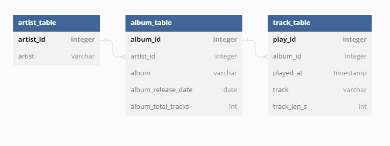
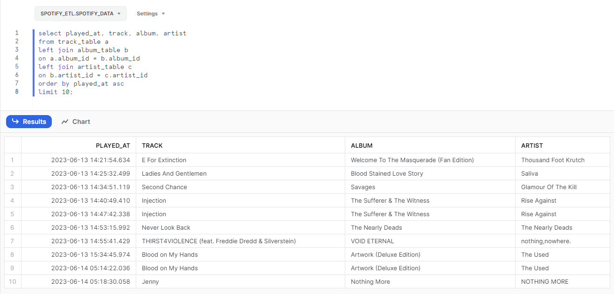

# spotify_etl

## Project overview

The goal of this project was to create an Airflow pipeline that retrieves recently listened songs from the Spotify API and uploads them to a database. The database consists of three tables: artist_table, album_table, and track_table. The pipeline runs daily and performs the following steps:

1. Launch Browser to Get Authorization Code:
    * This task opens a headless browser and authenticates the user with Spotify API to obtain an authorization code.
2. Get Token:
    * This task exchanges the authorization code for a token, which is valid for one hour, using the Spotify API
3. Get Recently Listened Songs:
    * This task retrieves the recently listened songs from the Spotify API using the obtained token. It fetches the latest songs played during the past 24 hours and returns them as a JSON object. The max amount of songs is 50.
4. Convert JSON to Pandas DataFrame:
    * This task extracts the desired information from the JSON response obtained in the previous step and converts it into a Pandas DataFrame.
5. Split Pandas DataFrame:
    * This task splits the single Pandas DataFrame into three separate DataFrames: song_data, album_data, and artist_data.
6. Load Artist Data to Snowflake
    * This task adds the artist data to the Snowflake database's artist_table. It checks if each artist already exists in the table and inserts new artists if needed.
7. Load Album Data to Snowflake:
    * This task adds the album data to the Snowflake database's album_table. It checks if each album already exists in the table and inserts new albums if needed. It also fetches the artist_id from the artist_table as a foreign key.
8. Load Track Data to Snowflake:
    * This task adds the track data to the Snowflake database's track_table.  It also fetches the album_id from the album_table as a foreign key.

The project utilizes Airflow's task-based approach to orchestrate the pipeline. Each task represents a specific step in the data extraction, transformation, and loading process. The tasks are executed sequentially, with dependencies between them.

The pipeline is designed to run daily at 00:00, ensuring that it retrieves the recently listened songs for the previous day. The project makes use of the Spotify API for authentication and data retrieval, as well as the Snowflake database for storing the extracted song, album, and artist information.

## Database design

The project database consists of 3 different tables: artist table, album table and track table. 

In designing the data schema for the Spotify API data loaded into Snowflake, a crucial decision was made to split the data into three separate tables instead of storing everything in a single table. This approach was taken to ensure data integrity, maintain efficient data management, and avoid potential pitfalls when it came to data deletion and updates.

One of the main reasons behind this decision was to prevent inadvertent loss of related data. By separating the data into three tables, specifically for tracks, albums, and artists, we established clear boundaries between different entities in the data model. This segregation allowed for more granular control over data manipulation operations such as deletion.

# Conclusion

In conclusion, this project aimed to explore the integration of Apache Airflow with various service providers, focusing on understanding Airflow's concepts and implementing connections to enable seamless integration. Throughout the project, we successfully achieved the project's objectives and gained valuable insights into data engineering practices.

A snapshot of the data in Snowflake:

